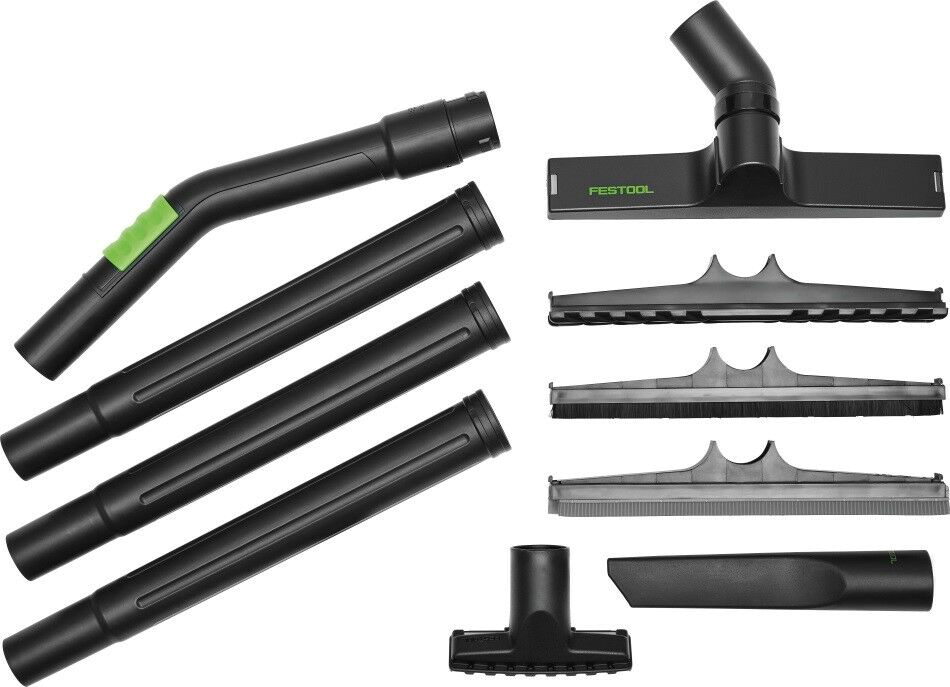
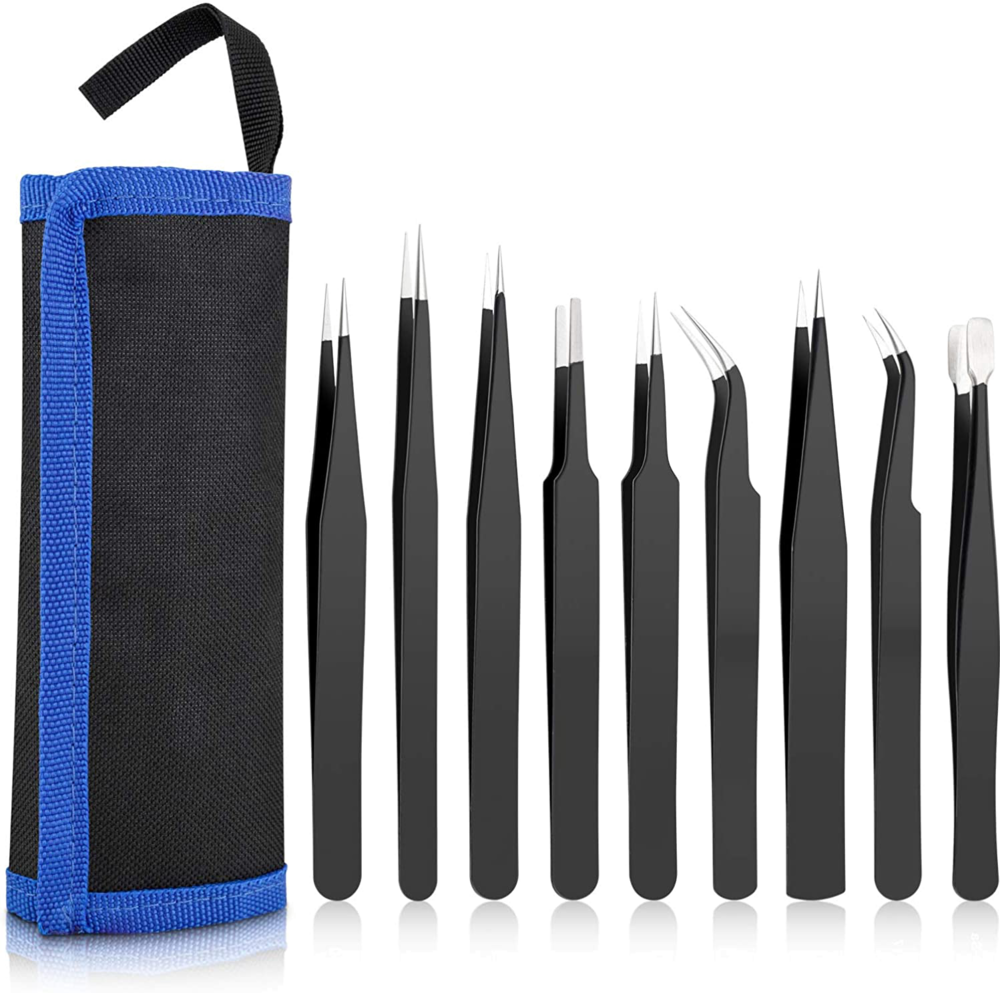
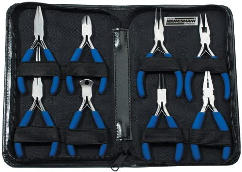
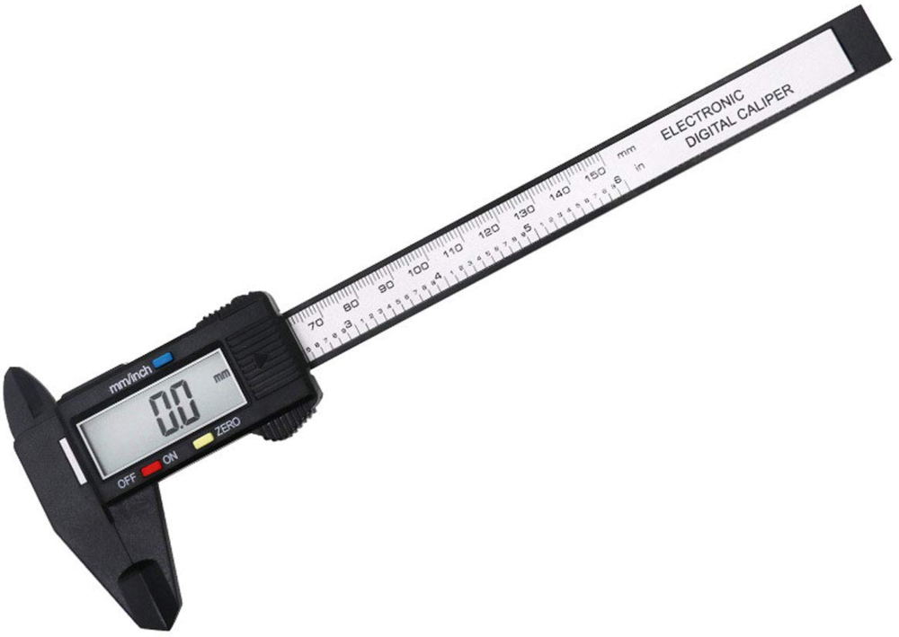

| ID     | Name                                                                   | Kategorie                                | Location   | Image                                 | Shop                                                                                                                                                                  |
| ------ | ---------------------------------------------------------------------- | ---------------------------------------- | ---------- | ------------------------------------- | ---------------------------------------------------------------                                                                                                       |
| I106   | Phrozen Sonic MINI 4K! Resin Printer                                   | 3d-Drucker SLA                           |            |    | https://phrozen3d.com/products/sonic-mini-4k-resin-3d-printer-phrozen                                                                                                 |
| I135   | Gerade und gebogene Zangen Pinzetten                                   | 3d-Drucker SLA - Werkzeug                |            |    | https://www.amazon.de/gp/product/B0758JW89J/                                                                                                                          |
| I134.1 | Seitenschneider                                                        | 3d-Drucker SLA - Werkzeug                |            |    | https://www.amazon.de/gp/product/B07P9NP2R6/                                                                                                                          |
|    |                                                                        | 3d-Drucker SLA - Verbrauchsmaterial      |            |                                       |                                                                                                                                                                       |
| I169.1 | Prusa i3 MK3S+ 3D printer                                              | 3d-Drucker FDM                           |            |    | https://shop.prusa3d.com/en/3d-printers/181-original-prusa-i3-mk3s-3d-printer.html                                                                                    |
| I169.2 | Prusa i3 MK3S+ 3D printer                                              | 3d-Drucker FDM                           |            |    | https://shop.prusa3d.com/en/3d-printers/181-original-prusa-i3-mk3s-3d-printer.html                                                                                    |
| I170.1 | PRUSA MINI+                                                            | 3d-Drucker FDM                           |            |    | https://shop.prusa3d.com/en/3d-printers/994-original-prusa-mini.html                                                                                                  |
| I170.2 | PRUSA MINI+                                                            | 3d-Drucker FDM                           |            |    | https://shop.prusa3d.com/en/3d-printers/994-original-prusa-mini.html                                                                                                  |
| I170.3 | PRUSA MINI+                                                            | 3d-Drucker FDM                           |            |    | https://shop.prusa3d.com/en/3d-printers/994-original-prusa-mini.html                                                                                                  |
| I170.4 | PRUSA MINI+                                                            | 3d-Drucker FDM                           |            |    | https://shop.prusa3d.com/en/3d-printers/994-original-prusa-mini.html                                                                                                  |
|        |                                                                        | 3d-Drucker FDM - Werkzeug                |            |                                       |                                                                                                                                                                       |
|        |                                                                        | 3d-Drucker FDM - Werkzeug                |            |                                       |                                                                                                                                                                       |
| I172   | Maul-Ringschlüssel SW 7 mm                                             | 3d-Drucker FDM - Werkzeug                |            |    | https://www.amazon.de/gp/product/B001ILE9A2/                                                                                                                          |
| I171   | Innensechskant, lang, 1,5mm                                            | 3d-Drucker FDM - Werkzeug                |            |    | https://www.amazon.de/gp/product/B001NYZQOM/                                                                                                                          |
| I134.2 | Seitenschneider                                                        | 3d-Drucker FDM - Werkzeug                |            |    | https://www.amazon.de/gp/product/B07P9NP2R6/                                                                                                                          |
|        |                                                                        | 3d-Drucker FDM - Verbrauchsmaterial      |            |                                       |                                                                                                                                                                       |
| I168   | Hartgestein-Mess- und Prüfplatte 630 x 400 x 100 mm Bernardo           | Anreisplatte                             |            |    | https://www.bernardo-maschinen.com/hartgestein-mess-und-pruefplatte-630-x-400-x-100-mm-bernardo-mes.html                                                              |
| I20    | Digital-Höhenreißer / Höhenmessgerät 300 mm                            | Anreisplatte - Werkzeug                  |            |     | https://www.paulimot.de/messen-pruefen/hoehenreisser-messgeraete/digital/1090/digital-hoehenreisser/hoehenmessgeraet-300-mm                                           |
| I121   | Höhenreißer, Höhenmessgerät 0-200 mm                                   | Anreisplatte - Werkzeug                  |            |    | https://www.paulimot.de/detail/index/sArticle/2437                                                                                                                    |
| I52    | Reißnadel aus Hartmetall als Druckbleistift 146 mm                     | Anreisplatte - Werkzeug                  |            |     | https://www.paulimot.de/messen-pruefen/anreissen/reissnadeln/880/reissnadel-aus-hartmetall-als-druckbleistift-146-mm                                                  |
| I53    | Anreißzirkel, 160 mm                                                   | Anreisplatte - Werkzeug                  |            |     | https://www.paulimot.de/anreisszirkel/160mm                                                                                                                           |
| I54    | Stahllineal, 200 mm                                                    | Anreisplatte - Werkzeug                  |            |     | https://www.paulimot.de/messen-pruefen/anreissen/stahllineale/1421/stahllineal-200-mm                                                                                 |
| I55    | Anreißzirkel, Bogenzirkel 150 mm mit Bleistifthalter u. Anreißnadel    | Anreisplatte - Werkzeug                  |            |     | https://www.paulimot.de/anreizirkel/bogenzirkel-150-mm-mit-bleistifthalter                                                                                            |
| I119   | Anreiss Messschieber Streichmaß mit Rolle 200 mm                       | Anreisplatte - Werkzeug                  |            |    | https://www.amazon.de/gp/product/B00AZK34YY/                                                                                                                          |
| I56    | Winkelmesser digital, Gehäuse aus Aluminium                            | Anreisplatte - Messzeug                  |            |     | https://www.paulimot.de/messen-pruefen/winkelmesser/digital/1088/winkelmesser-digital-gehaeuse-aus-aluminium                                                          |
| I57    | Winkelmesser, Gradmesser 80 x 120 mm Standard-Ausführung               | Anreisplatte - Messzeug                  |            |     | https://www.paulimot.de/messen-pruefen/winkelmesser/analog/553/winkelmesser/gradmesser-80-x-120-mm                                                                    |
| I58    | Winkelmesser, Gradmesser mit verstellbarer Schiene 150 x 300 mm        | Anreisplatte - Messzeug                  |            |     | https://www.paulimot.de/messen-pruefen/winkelmesser/analog/709/winkelmesser/gradmesser-mit-verstellbarer-schiene-150-x-300-mm                                         |
| I79    | Anschlagwinkel 90° 120 x 70 mm, DIN 875/1                              | Anreisplatte - Anschlagmittel            |  K30       |     | https://www.paulimot.de/anschlagwinkel/90/120x70                                                                                                                      |
| I80    | Anschlagwinkel 45° 120 x 80 mm INOX                                    | Anreisplatte - Anschlagmittel            |  K30       |     | https://www.paulimot.de/anschlagwinkel/45/120x80mm                                                                                                                    |
| I81    | Präzisions-Haarlineal 150 mm, DIN 875/00, rostfrei INOX                | Anreisplatte - Anschlagmittel            |  K30       |     | https://www.paulimot.de/haarlineal/150mm/inox                                                                                                                         |
| I82    | Anschlagwinkel 90° 100 x 70 mm, DIN 875/0, rostfrei INOX               | Anreisplatte - Anschlagmittel            |  K30       |     | https://www.paulimot.de/anschlagwinkel/90/100x70mm                                                                                                                    |
| I83    | Präzisions-Haarwinkel 90° 100 x 70 mm, DIN 875/00, rostfrei INOX       | Anreisplatte - Anschlagmittel            |  K30       |     | https://www.paulimot.de/haarwinkel/90/100x70mm                                                                                                                        |
| I84    | Präzisions-Haarlineal 100 mm, DIN 874/00, rostfrei INOX                | Anreisplatte - Anschlagmittel            |  K30       |     | https://www.paulimot.de/haarlineal/100mm/rostfrei/inox                                                                                                                |
| I85    | Flachwinkel 90° 150 x 100 mm, DIN 875/0, rostfrei INOX                 | Anreisplatte - Anschlagmittel            |  K30       |     | https://www.paulimot.de/flachwinkel/90/150x100mm-                                                                                                                     |
| I44    | Zentrierwinkel 100 x 70 mm                                             | Anreisplatte - Anschlagmittel            |            |     | https://www.paulimot.de/messen-pruefen/winkel/zentrierwinkel/435/zentrierwinkel-100-x-70-mm                                                                           |
| I45    | Zentrierwinkel 200 x 150 mm                                            | Anreisplatte - Anschlagmittel            |            |     | https://www.paulimot.de/messen-pruefen/winkel/zentrierwinkel/309/zentrierwinkel-200-x-150-mm                                                                          |
| I120   | Winkelprisma verstellbar Schwenkprisma                                 | Anreisplatte - Anschlagmittel            | K30        |    | https://www.amazon.de/gp/product/B003V8T572/                                                                                                                          |
| I122   | Prismen-Paar mit Spannbügeln, je 75 x 56 x 56 mm bis 50 mm             | Anreisplatte - Anschlagmittel            | K30        |    | https://www.paulimot.de/prismen/spannbuegel/75x55x56mm                                                                                                                |
| I123   | Prismen-Block, magnetisch, 71 x 55 x 74 mm                             | Anreisplatte - Anschlagmittel            | K30        |    | https://www.paulimot.de/prismen/magnetisch                                                                                                                            |
| I124   | Aufspannwinkel 90° 150 x 125 x 115 mm                                  | Anreisplatte - Anschlagmittel            | K30        |    | https://www.paulimot.de/aufspannwinkel-150-x-125-x-115-mm                                                                                                             |
| I125   | Aufspannwinkel 90° 90 x 77 x 64 mm                                     | Anreisplatte - Anschlagmittel            | K30        |    | https://www.paulimot.de/aufspannwinkel-90-x-77-x-64-mm                                                                                                                |
| I21    | Schleiflehre für Spiralbohrer bis Ø 50 mm                              | Anreisplatte - Lehren                    | K7           |     | https://www.paulimot.de/messen-pruefen/lehren/schleiflehren/854/schleiflehre-fuer-spiralbohrer-bis-oe-50-mm                                                           |
| I22    | Gewindelehre metrisch, zoll aus Federstahl                             | Anreisplatte - Lehren                    | K7           |     | https://www.paulimot.de/messen-pruefen/lehren/gewindelehren/851/gewindelehre-metrisch/zoll-aus-federstahl                                                             |
| I23    | Radienlehre R1 - R7 aus Federstahl                                     | Anreisplatte - Lehren                    | K7           |     | https://www.paulimot.de/radienlehre/r1/r7                                                                                                                             |
| I24    | Universal-Schleiflehre mit Winkeln 120°, 90°, 60° und 55°              | Anreisplatte - Lehren                    | K7           |     | https://www.paulimot.de/universal-schleiflehre/120/90/60/55                                                                                                           |
| I25    | Lochlehre metrisch, zoll, 1 - 16 mm                                    | Anreisplatte - Lehren                    | K7           |     | https://www.paulimot.de/lochlehre-metrisch-/-zoll,-1-16-mm                                                                                                            |
| I26    | Bohrerlehre, metrisch 1-13 mm                                          | Anreisplatte - Lehren                    | K7           |     | https://www.paulimot.de/messen-pruefen/lehren/bohrerlehren/2045/bohrerlehre-metrisch-1-13-mm                                                                          |
| I27    | Fühlerlehren-Satz 13 Blatt, Messbereich 0,05-1,00 mm                   | Anreisplatte - Lehren                    | K7            |     | https://www.paulimot.de/fuehlerlehren-satz-13-blatt,-0,05-1,00-mm                                                                                                     |
| I28    | Fühlerlehren-Satz 20 Blatt, Messbereich 0,05-1,00 mm                   | Anreisplatte - Lehren                    | K7           |     | https://www.paulimot.de/fuehlerlehren-satz-20-blatt,-0,05-1,00-mm                                                                                                     |
| I29    | Kombinierte Gewindestahllehre für Trapez- und Flachgewinde             | Anreisplatte - Lehren                    | K7           |     | https://www.paulimot.de/kombinierte-gewindestahllehre-fuer-trapez--und-flachgewinde                                                                                   |
| I30    | Trapez-Gewindestahllehre DIN 103, 30°, 2-12 mm                         | Anreisplatte - Lehren                    | K7           |     | https://www.paulimot.de/trapez-gewindestahllehre-din-103,-30,-2-12-mm                                                                                                 |
| I31    | Schleiflehre für Spiralbohrer bis Ø 60 mm                              | Anreisplatte - Lehren                    | K7           |     | https://www.paulimot.de/schleiflehre/spiralbohrer/60mm                                                                                                                |
| I32    | Universal-Schleiflehre für Spiralbohrer                                | Anreisplatte - Lehren                    | K7           |     | https://www.paulimot.de/universal-schleiflehre_spiralbohrer                                                                                                           |
| I33    | Kombinierte Dreh- und Gewindestahllehre                                | Anreisplatte - Lehren                    | K7           |     | https://www.paulimot.de/kombinierte_dreh/gewindestahllehre                                                                                                            |
| I34    | Kombinierte Gewindestahllehre für Spitz- und Flachgewinde              | Anreisplatte - Lehren                    | K7           |     | https://www.paulimot.de/gewindestahllehre/spitz-und-flachgewinde                                                                                                      |
| I35    | Schleiflehre für HSS-Drehstähle                                        | Anreisplatte - Lehren                    | K7           |     | https://www.paulimot.de/schleiflehre/hss-drehstaehle                                                                                                                  |
| I36    | Schleiflehre für Hartmetall-Drehstähle                                 | Anreisplatte - Lehren                    | K7           |     | https://www.paulimot.de/schleiflehre/hartmetall-drehstaehle                                                                                                           |
| I37    | Radienlehre R7,5 - R15,0 aus Federstahl                                | Anreisplatte - Lehren                    | K7           |     | https://www.paulimot.de/messen-pruefen/lehren/radienlehren/2291/radienlehre-r7-5-r15-0-aus-federstahl                                                                 |
| I38    | Radienlehre R15,5 - R25 aus Federstahl                                 | Anreisplatte - Lehren                    | K7           |     | https://www.paulimot.de/messen-pruefen/lehren/radienlehren/2293/radienlehre-r15-5-r25-aus-federstahl                                                                  |
| I46    | Parallel-Endmaß Set 32-teilig, Genauigkeitsklasse II, DIN 861          |                                          | K7           |     | https://www.paulimot.de/parallel-endma-set-32-teilig,-genauigkeitsklasse-i,-din-861                                                                                   |
| I49    | Diamant Lösemittel-Spray, Sprühdose mit 400 ml Inhalt                  | Anreisplatte - Verbrauchsmaterial        |            |     | https://www.paulimot.de/loesemittelspray-spruehdose-400ml                                                                                                             |
| I50    | Diamant Anreißfarbstift rot                                            | Anreisplatte - Verbrauchsmaterial        |            |     | https://www.paulimot.de/anreissfarbstift-rot                                                                                                                          |
| I51    | Diamant Anreißfarbstift blau                                           | Anreisplatte - Verbrauchsmaterial        |            |     | https://www.paulimot.de/anreissfarbstift-blau                                                                                                                         |
|        |                                                                        | Bestückungsmaschine                      |            |                                       |                                                                                                                                                                       |
|        |                                                                        | Bestückungsmaschine - Verbrauchsmaterial |            |                                       |                                                                                                                                                                       |
| I147   | Kabelcrimper YTH214 Computer Flachkabel Crimpzange                     | Crimpenzangen                            |            |    | https://www.amazon.de/gp/product/B07KW8THD3/ref=ppx_yo_dt_b_asin_title_o06_s00?ie=UTF8&psc=1                                                                          |
| I132   | KNIPEX MultiCrimp Crimpzange mit Wechselmagazin (250 mm) 97 33 02      | Crimpenzangen                            |            |    | https://www.amazon.de/gp/product/B00203M5YO/                                                                                                                          |
| I1     | Drehmaschine SIEG SC10 mit 230 Volt Motor mit Messsystem               | Drehmaschine                             |            |      | https://www.paulimot.de/drehbank/sc10mitmesssystem                                                                                                                    |
| I5     | Präzisions-Schnellspann-Bohrfutter 1-16 mm MK3                         | Drehmaschine - Zubehör                   |  K4        |      | https://www.paulimot.de/drehen/bohrfutter/bohrfutter/1143/praezisions-schnellspann-bohrfutter-1-16-mm-mk3                                                             |
| I6     | Mitlaufende Körnerspitze Zentrierspitze MK3                            | Drehmaschine - Zubehör                   |  K4        |      | https://www.paulimot.de/mitlaufende_zentrierspitze_mk3                                                                                                                |
| I7     | Schnellwechsel-Stahlhalter-Set, System "Multifix", Größe A             | Drehmaschine - Zubehör                   |  K8        |      | https://www.paulimot.de/maschinen/maschinenzubehoer/schnellwechsel-stahlhalter/system-multifix-groesse-a/256/schnellwechsel-stahlhalter-set-system-multifix-groesse-a |
| I8     | Lünette feststehend für SIEG SC10                                      | Drehmaschine - Zubehör                   |  K8        |      | https://www.paulimot.de/drehen/luenetten/feststehend/835/luenette-feststehend-fuer-sieg-sc10                                                                          |
| I197   | Präzisionswelle 20mm h6 geschliffen & gehärtet, 250mm                  | Drehmaschine - Zubehör                   |  K8        |    | https://www.amazon.de/dp/B011L5BUWY/                                                                                                                          |
| I198   | Präzisionswelle 20mm h6 geschliffen & gehärtet, 400mm                  | Drehmaschine - Zubehör                   |  K8        |    | https://www.amazon.de/dp/B011L5552K/                                                                                                                          |
| I199   | Präzisionswelle 20mm h6 geschliffen & gehärtet, 700mm                  | Drehmaschine - Zubehör                   |            |    | https://www.amazon.de/dp/B011L55MRS/                                                                                                                          |
| I2     | Wechselrad-Erweiterungs-Set für Drehmaschine SIEG SC10                 | Drehmaschine - Zubehör                   |  K8        |      | https://www.paulimot.de/wechselrad-erweiterungs-set-fuer-drehmaschine-sieg-sc10                                                                                       |
| I9     | Reduzierhülse von MK3 auf MK1                                          | Drehmaschine - Zubehör                   |  K4        |      | https://www.paulimot.de/weitere-werkzeuge/adapterhuelsen/reduzierhuelsen/330/reduzierhuelse-von-mk3-auf-mk1                                                           |
| I10    | Reduzierhülse von MK3 auf MK2                                          | Drehmaschine - Zubehör                   |  K4        |     | https://www.paulimot.de/weitere-werkzeuge/adapterhuelsen/reduzierhuelsen/331/reduzierhuelse-von-mk3-auf-mk2                                                           |
| I13    | Gewindeschneid-Einrichtung für Reitstock MK2+MK3                       | Drehmaschine - Zubehör                   |  K4        |     | https://www.paulimot.de/weitere-werkzeuge/gewindeschneiden/sets/836/gewindeschneid-einrichtung-fuer-reitstock-mk2-mk3                                                 |
| I184   | Vierbackenfutter , 160 mm, zentral verstellbare Backen                 | Drehmaschine - Zubehör                   |  K9        |    | https://www.paulimot.de/drehen/drehbankfutter/vierbackenfutter-zentral-verstellbar/141/vierbackenfutter-fuer-drehbank-160-mm-zentral-verstellbare-backen                                               |
| I185   | Vierbackenfutter für Drehbank, 160 mm, einzeln verstellbare Backen     | Drehmaschine - Zubehör                   |  K9        |    | https://www.paulimot.de/drehen/drehbankfutter/vierbackenfutter-einzeln-verstellbar/144/vierbackenfutter-fuer-drehbank-160-mm-einzeln-verstellbare-backen                                                  |
| I3     | Drehmeißel-Set mit Wendeplatten, 12 mm, inkl. Bohrstange Ø 10 mm       | Drehmaschine - Werkzeug                  |            |      | https://www.paulimot.de/drehmeissel-set-mit-wendeplatten/12-mm/-5-teilig                                                                                              |
| I4     | Drehmeißel-Set mit Wendeplatten, 12mm, 9-teilig                        | Drehmaschine - Werkzeug                  |            |      | https://www.paulimot.de/drehmeissel-set/mit_wendeplatte/12mm-                                                                                                         |
| I11    | Rändelrad Rändelwerkzeug mit 6 HSS-Rädern, 12x12mm                     | Drehmaschine - Werkzeug                  |            |     | https://www.paulimot.de/raendelwerkzeug/set/12x12mm                                                                                                                   |
| I12    | Rändelrad Rändelwerkzeug mit 6 HSS-Rädern, 10x10mm                     | Drehmaschine - Werkzeug                  |            |     | https://www.paulimot.de/raendelwerkzeug/set/10x10mm                                                                                                                   |
| I43    | Zentrierbohrer-Set 6-teilig HSS Standard                               | Drehmaschine - Werkzeug                  |            |     | https://www.paulimot.de/zentrierbohrer-set/hss                                                                                                                        |
| I59    | HSS-Maschinenreibahlen-Set 7-teilig 3 - 12 mm, Passung H7 Array        | Drehmaschine - Werkzeug                  |            |     | https://www.paulimot.de/hss-maschinenreibahlen-set/7-teilig/3---12-mm/passung-h7                                                                                      |
| I14    | Tiefenmessschieber 0-150 mm INOX                                       | Drehmaschine - Messmittel                |            |     | https://www.paulimot.de/messen-pruefen/messschieber/tiefenmessschieber/424/tiefenmessschieber-0-150-mm-inox                                                           |
| I15    | Messschieber digital 0 - 150 mm, rostfrei INOX                         | Drehmaschine - Messmittel                |            |     | https://www.paulimot.de/messschieber-digital-0-150-mm-rostfrei-inox                                                                                                   |
| I16    | Messstativ mit Magnetfuß und Feinjustierung                            | Drehmaschine - Messmittel                |            |     | https://www.paulimot.de/messstativ-mit-magnetfu-und-feinjustierung                                                                                                    |
| I17    | Mikrometer Bügelmessschraube 0-25 mm                                   | Drehmaschine - Messmittel                |            |     | https://www.paulimot.de/mikrometer-buegelmessschraube-0-25-mm                                                                                                         |
| I18    | Mikrometer Bügelmessschraube 25-50 mm                                  | Drehmaschine - Messmittel                |            |     | https://www.paulimot.de/mikrometer-buegelmessschraube-25-50-mm-                                                                                                       |
| I19    | Mikrometer Bügelmessschraube 50-75 mm                                  | Drehmaschine - Messmittel                |            |     | https://www.paulimot.de/mikrometer-buegelmessschraube-50-75-mm                                                                                                        |
| I39    | Teleskoplehren-Satz 8 bis 150 mm, 6-teilig                             | Drehmaschine - Messmittel                |            |     | https://www.paulimot.de/teleskoplehren-satz/6-teilig/8-155mm                                                                                                          |
| I142   | Cyclists 23 Teilig Fahrrad Reparaturset                                | Fahrradwerkzeug                          |            |    | https://www.amazon.de/gp/product/B07VNJZ25S/                                                                                                                          |
| I61    | Bohr-,Fräsmaschine SIEG SX4 m. el. Antrieb f. Z-Achse und Messsystem   | Fräsmaschine                             |            |     | https://www.paulimot.de/fraesmaschine/sx4/dro                                                                                                                         |
| I62    | Spannpratzen-Set 58-teilig M12 , 14 mm im Koffer                       | Fräsmaschine - Zubehör                   |  K22       |     | https://www.paulimot.de/weitere-werkzeuge/spannmittel/spannpratzen/565/spannpratzen-set-58-teilig-m12/14-mm-im-koffer                                                 |
| I63    | Präzisions-Schnellspann-Bohrfutter 1-16 mm SK30 / M12 (DIN 2080)       | Fräsmaschine - Zubehör                   |  K25       |     | https://www.paulimot.de/fraesen/bohrfutter/bohrfutter/1145/praezisions-schnellspann-bohrfutter-1-16-mm-sk30/m12-din-2080                                              |
| I64    | ER32-Spannzangen-Set 2 - 20 mm SK30 (DIN 2080) / M12 im Alu-Koffer     | Fräsmaschine - Zubehör                   |  K25       |     | https://www.paulimot.de/fraesen/spannzangen/er-spannzangen/sets/318/er32-spannzangen-set-2-20-mm-sk30-din-2080/m12-im-alu-koffer                                      |
| I65    | Maschinen-Schraubstock 100 mm Backenbreite 360° drehbar                | Fräsmaschine - Zubehör                   |            |     | https://www.paulimot.de/weitere-werkzeuge/schraubstoecke/maschinenschraubstoecke-drehbar/1398/maschinen-schraubstock-100-mm-backenbreite-3600-drehbar                 |
| I68    | Teilapparat Rundtisch Ø 150 mm schwenkbar VERTEX VU-150                | Fräsmaschine - Zubehör                   |  K6        |     | https://www.paulimot.de/fraesen/teilapparate-mit-zubehoer/teilapparate/757/teilapparat-rundtisch-oe-150-mm-schwenkbar-vertex-vu-150                                   |
| I73    | Parallelunterlagen-Set 18-teilig Länge 120 mm                          | Fräsmaschine - Zubehör                   |            |     | https://www.paulimot.de/parallelunterlagen-set/18-teilig/laenge120mm                                                                                                  |
| I74    | Spannpratzen-Set 58-teilig M6 / 8 mm im Koffer                         | Fräsmaschine - Zubehör                   |            |     | https://www.paulimot.de/weitere-werkzeuge/spannmittel/spannpratzen/523/spannpratzen-set-58-teilig-m6/8-mm-im-koffer                                                   |
| I67    | HSS-Maschinenreibahlen-Set 7-teilig 3 - 12 mm, Passung H7              | Fräsmaschine - Werkzeug                  |            |     | https://www.paulimot.de/hss-maschinenreibahlen-set/7-teilig/3---12-mm/passung-h7                                                                                      |
| I69    | Schaftfräser 12 mm + 20 x Ersatz-Schneidplatte                         | Fräsmaschine - Werkzeug                  |            |     | https://www.paulimot.de/schaftfraeser-12-mm-20-x-ersatz-schneidplatte                                                                                                 |
| I70    | Fingerfräser- / Schaftfräser-Set 22-teilig titanbeschichtet            | Fräsmaschine - Werkzeug                  |            |     | https://www.paulimot.de/fraesen/fraeser/sets/149/fingerfraeser/schaftfraeser-set-22-teilig-titanbeschichtet                                                           |
| I156   | Schaftfräser Schlicht Fräser Set HSS-M2 TiN 3,4,5,6,8,10,12 mm         | Fräsmaschine - Werkzeug                  |            |    | https://www.amazon.de/gp/product/B01HRH85TQ/                                                                                                                          |
| I157   | Schaftfräser mit 4 Rillen, 2 - 12 mm, 10 Stück                         | Fräsmaschine - Werkzeug                  |            |    | https://www.amazon.de/gp/product/B07DQL66VF/                                                                                                                          |
| I154   | Maschinengewindebohrer Satz , 14-teilig                                | Fräsmaschine - Werkzeug                  |            |    | https://www.amazon.de/gp/product/B008HO9XQ8/                                                                                                                          |
| I149.1 | Kegelsenker Set 6-teilig  6,3-20,5 mm                                  |                                          |            |    | https://www.amazon.de/gp/product/B00ELDU5FM/                                                                                                                          |
| I149.2 | Kegelsenker Set 6-teilig  6,3-20,5 mm                                  | Fräsmaschine - Werkzeug                  |            |    | https://www.amazon.de/gp/product/B00ELDU5FM/                                                                                                                          |
| I149.3 | Kegelsenker Set 6-teilig  6,3-20,5 mm                                  | Drehmaschine - Werkzeug                  |            |    | https://www.amazon.de/gp/product/B00ELDU5FM/                                                                                                                          |
| I71    | Kantentaster mit 16 mm Schaft, optisch und akustisch                   | Fräsmaschine - Messmittel                |            |     | https://www.paulimot.de/kantentaster-mit-16-mm-schaft-optisch-und-akustisch                                                                                           |
| I72    | Kantentaster mit 4 und 10 mm Tastkopf, antimagnetisch                  | Fräsmaschine - Messmittel                |            |     | https://www.paulimot.de/kantentaster-mit-4-und-10-mm-tastkopf-antimagnetisch                                                                                          |
| I75    | Messschieber digital 0 - 150 mm, rostfrei INOX                         | Fräsmaschine - Messmittel                |            |     | https://www.paulimot.de/messschieber-digital-0-150-mm-rostfrei-inox                                                                                                   |
| I76    | Mikrometer Bügelmessschraube 0-25 mm                                   | Fräsmaschine - Messmittel                |            |     | https://www.paulimot.de/mikrometer-buegelmessschraube-0-25-mm                                                                                                         |
| I77    | Mikrometer Bügelmessschraube 25-50 mm                                  | Fräsmaschine - Messmittel                |            |     | https://www.paulimot.de/mikrometer-buegelmessschraube-25-50-mm-                                                                                                       |
| I78    | Mikrometer Bügelmessschraube 50-75 mm                                  | Fräsmaschine - Messmittel                |            |     | https://www.paulimot.de/mikrometer-buegelmessschraube-50-75-mm                                                                                                        |
| I87    | Draper 46609 Metrisches Messuhr-Set                                    | Fräsmaschine - Messmittel                |            |     | https://www.amazon.de/dp/B0034BK64M/                                                                                                                                  |
| I66    | SONAX SX90 PLUS mit EasySpray 400 ml                                   | Fräsmaschine - Verbrauchsmaterial        |            |     | https://www.paulimot.de/weitere-werkzeuge/verbrauchsstoffe/multifunktionsoele/1106/sonax-sx90-plus-mit-easyspray-400-ml                                               |
| I107   | iFixit Öffnungswerkzeug                                                | HandyReparatur                           |   K72      |    | https://store.ifixit.de/products/ifixit-opening-tool                                                                                                                  |
| I108   | iFixit Werkzeugset zum Hebeln und Öffnen                               | HandyReparatur                           |   K72      |    | https://store.ifixit.de/products/prying-and-opening-tool-assortment                                                                                                   |
| I109   | iFixit Heißluftgebläse (Heat Gun)                                      | HandyReparatur                           |   K72      |    | https://store.ifixit.de/products/heat-gun                                                                                                                             |
| I110   | iFixit Kopfbandlupe                                                    | HandyReparatur                           |   K72      |    | https://store.ifixit.de/products/head-magnifier                                                                                                                       |
| I111   | iFixit Prüflupe mit LED                                                | HandyReparatur                           |   K72      |    | https://store.ifixit.de/products/inspection-scope                                                                                                                     |
| I112   | iFixit Schraubenlösende Zange                                          | HandyReparatur                           |   K72      |    | https://store.ifixit.de/products/screw-extracting-pliers                                                                                                              |
| I113   | iFixit GripStick Extraktionswerkzeug für Kopfhörerstecker              | HandyReparatur                           |   K72      |    | https://store.ifixit.de/products/gripstick-headphone-plug-extraction-tool                                                                                             |
| I114   | iFixit Pro Tech Toolkit                                                | HandyReparatur                           |   K72      |    | https://store.ifixit.de/products/pro-tech-toolkit                                                                                                                     |
| I115   | iFixit Klebstoffentferner                                              | HandyReparatur                           |   K72      |    | https://store.ifixit.de/products/ifixit-adhesive-remover                                                                                                              |
| I116   | iFixit Repair Business Toolkit                                         | HandyReparatur                           |   K72      |    | https://store.ifixit.de/products/repair-business-toolkit                                                                                                              |
| I88    | Festool Getriebe-Exzenterschleifer RO 90 DX FEQ-Plus                   | Holzwerkstatt - Maschine                 |            |     | https://www.contorion.de/elektrowerkzeug/festool-getriebe-exzenterschleifer-ro-90-dx-feq-plus-54544209?aid=454432982282                                               |
| I89    | Festool Oberfräse OF 1010 EBQ-Plus + Box-OF-S 8/10x HW                 | Holzwerkstatt - Maschine                 |            |     | https://www.contorion.de/elektrowerkzeug/festool-oberfraese-of-1010-ebq-plus-box-of-s-8-10x-hw-92214488                                                               |
| I90    | Festool Pendelstichsäge CARVEX PSB 420 EBQ-Plus                        | Holzwerkstatt - Maschine                 |            |     | https://www.amazon.de/dp/B008VWIUBU/                                                                                                                                  |
| I91    | Festool Tauchsäge TS 55 REBQ-Plus-FS                                   | Holzwerkstatt - Maschine                 |            |     | https://www.contorion.de/elektrowerkzeug/festool-tauchsaege-ts-55-rebq-plus-fs-89781193?aid=347528681949                                                              |
| I167   | Spindel-Bandschleifmaschine                                            | Holzwerkstatt - Maschine                 |            |    | https://www.amazon.de/gp/product/B07QGFD2NG/                                                                                                                          |
| I92    | Festool Absaugmobil CTM 36 E AC CLEANTEC, Staubklasse M                | Holzwerkstatt - Zubehör                  |            |     | https://www.contorion.de/reinigen/festool-absaugmobil-ctm-36-e-ac-cleantec-staubklasse-m-62553410                                                                     |
| I93    | Festool CT Vorabscheider CT-VA-20                                      | Holzwerkstatt - Zubehör                  |            |     | https://www.festool.de/produkte/saugen/vorabscheider/204083---ct-va-20                                                                                                |
| I94    | Festool Standard-Reinigungsset D 27/D 36 S-RS                          | Holzwerkstatt - Zubehör                  |            |     | https://www.contorion.de/reinigen/festool-standard-reinigungsset-d-27-d-36-s-rs-65502575                                                                              |
| I95    | Festool Multifunktionstisch MFT/3                                      | Holzwerkstatt - Zubehör                  |            |     | https://www.contorion.de/betriebsausstattung-baustellenbedarf/festool-multifunktionstisch-mft-3-79233431?aid=347528681958&targetid=dsa-825151224129                   |
| I96    | Festool Tisch TSB/1-MW 1000                                            | Holzwerkstatt - Zubehör                  |            |     | https://www.contorion.de/betriebsausstattung-baustellenbedarf/festool-tisch-tsb-1-mw-1000-76594612                                                                    |
| I99    | Festool Zubehör-Set FS-SYS/2                                           | Holzwerkstatt - Werkzeug                 |            |     | https://www.contorion.de/betriebsausstattung-baustellenbedarf/festool-zubehoer-set-fs-sys-2-51057252                                                                  |
| I100   | Festool Parallelanschlag FS-PA                                         | Holzwerkstatt - Werkzeug                 |            |    | https://www.contorion.de/elektrowerkzeug/festool-parallelanschlag-fs-pa-80347560                                                                                      |
| I101   | Festool Verlängerung FS PA VL                                          | Holzwerkstatt - Werkzeug                 |            |    | https://www.contorion.de/elektrowerkzeug/festool-verlaengerung-fs-pa-vl-80413097                                                                                      |
| I102   | Festool Führungsschiene FS 1900/2                                      | Holzwerkstatt - Werkzeug                 |            |    | https://www.festool.de/produkte/fuehrungssysteme/fuehrungsschienen/491503---fs-19002                                                                                  |
| I158   | Abziehstein Schleifstein Set,400,1000,3000,8000                        | Holzwerkstatt - Werkzeug                 |            |    | https://www.amazon.de/gp/product/B07P7NTKZ4/                                                                                                                          |
| I159   | Schleifklotz Kork 120 x 60 x 35 mm                                     | Holzwerkstatt - Werkzeug                 |            |    | https://www.amazon.de/gp/product/B00BZH4TYU/                                                                                                                          |
| I160   | Universalschleifer für Schleifstreifen 93 x 230 mm                     | Holzwerkstatt - Werkzeug                 |            |    | https://www.amazon.de/gp/product/B001CBZPMO/                                                                                                                          |
| I161   | Mini Schleifpapier Halter                                              | Holzwerkstatt - Werkzeug                 |            |    | https://www.amazon.de/gp/product/B00HDDBCC2/                                                                                                                          |
| I200   | Holzraspel, Feilen flachstumpf/halbrund/rund                           |                                          |            |    |  https://www.amazon.de/gp/product/B003KIY9E2/                                                                                                                         |
| I166   | Nageleisen,Brecheisen 800 mm                                           | Holzwerkstatt - Werkzeug                 |            |    | https://www.amazon.de/gp/product/B000UYVSXY/                                                                                                                          |
| I137   | Stufenbohrer Konusbohrer Schälbohrer Set 3-tlg.                        | Holzwerkstatt - Werkzeug                 |            |    | https://www.amazon.de/gp/product/B07ZHNJK86/                                                                                                                          |
| I155   | Tiefenanschlagringe Set 6mm,8mm,10mm,12mm,14mm                         | Holzwerkstatt - Werkzeug                 |            |    | https://www.amazon.de/gp/product/B0832G8S9B/                                                                                                                          |
| I103   | Festool Schnellspanner FS-RAPID/L                                      | Holzwerkstatt - Klemmen                  |            |    | https://www.contorion.de/handwerkzeug/festool-schnellspanner-fs-rapid-57446255                                                                                        |
| I136   | Festool 489570 Schraubzwinge Ganzstahl FSZ 120mm                       | Holzwerkstatt - Klemmen                  |  K57          |    | https://www.amazon.de/gp/product/B0036V8H8M/                                                                                                                          |
| I97    | Festool Hebelzwinge FS-HZ 160  2x                                      | Holzwerkstatt - Klemmen                  |  K57          |     | https://www.contorion.de/handwerkzeug/festool-hebelzwinge-fs-hz-160-50462688?                                                                                         |
| I98    | Festool Spannelemente MFT-SP 2-Stueck                                  | Holzwerkstatt - Klemmen                  |  K57          |     | https://www.contorion.de/handwerkzeug/festool-spannelemente-mft-sp-79687459                                                                                           |
| I192   | Rahmen-Bandspanner                                                     | Holzwerkstatt - Klemmen                  |  K57          |    | https://www.amazon.de/gp/product/B0001P19HW/                                                                                                                          |__
| I193   | Gehrungsspanner                                                        | Holzwerkstatt - Klemmen                  |  K57          |    | https://www.amazon.de/dp/B0041SVXBM/                                                                                                                          |
| I145   | Acryl Kunststoff Pvc Biegemaschine 600mm                               | Kunstoff Biegemaschine                   |            |    | https://www.amazon.de/gp/product/B07VWV3V3G/                                                                                                                          |
| I133   | Weller Euro Solder Fix 1ß20 Platinenhalter 360° schwenkbar             | Lötarbeitsplatz                          |            |    | https://www.amazon.de/gp/product/B002BZCJD8/                                                                                                                          |
| I144   | Infrarot Rework Station, Lötstation, IR6500 800W                       | Lötarbeitsplatz                          |            |    | https://www.amazon.de/gp/product/B07ZFB1CV1/                                                                                                                          |
| I146   | Heißluft Lötstation 1000 Watt                                          | Lötarbeitsplatz                          |            |    | https://www.amazon.de/gp/product/B07SD1WNZD/                                                                                                                          |
| I41    | Metallbandsäge GFW4013 Vario                                           | Metalbandsäge                            |            |     | https://www.paulimot.de/maschinen/bandsaegen/metallbandsaegen/1120/metallbandsaege-gfw4013-vario                                                                      |
| I47    | Bimetall-Sägeband für Metallbandsäge GFW4013 Vario                     | Metalbandsäge - Verbrauchsmaterial       |            |     | https://www.paulimot.de/weitere-werkzeuge/ersatz-und-verschleissteile/saegebaender/901/bimetall-saegeband-fuer-metallbandsaege-gfw4013-vario-made-in-germany          |
| I48    | SONAX SX90 PLUS mit EasySpray 400 ml                                   | Metalbandsäge - Verbrauchsmaterial       |            |     | https://www.paulimot.de/detail/index/sArticle/1106                                                                                                                    |
| I60    | Universal-Blechbearbeitungsmaschine 3 in 1 / 305                       | Metalbearbeitung                         |            |     | https://www.paulimot.de/universal-blechbearbeitungsmaschinen/305                                                                                                      |
| I152   | Schraubenausdreher Set für Beschädigte Schrauben 1-12mm                | Handwerkzeug                             |            |    | https://www.amazon.de/gp/product/B085DK83W1/                                                                                                                          |
| I140.1 | Wasserpumpenzange Rohrzange Set 175mm,250mm,300mm                      | Handwerkzeug - Zangen                    |  K29       |    | https://www.amazon.de/gp/product/B017P8NO4S/                                                                                                                          |
| I140.2 | Wasserpumpenzange Rohrzange Set 175mm,250mm,300mm                      | Handwerkzeug - Zangen                    |  K29       |    | https://www.amazon.de/gp/product/B017P8NO4S/                                                                                                                          |
| I141.1 | Gripzangen-Satz 4-tlg,  125,180,250mm,Langbeck-Gripzange 150mm         | Handwerkzeug - Zangen                    |  K29       |    | https://www.amazon.de/gp/product/B00871XXAI/                                                                                                                          |
| I141.2 | Gripzangen-Satz 4-tlg,  125,180,250mm,Langbeck-Gripzange 150mm         | Handwerkzeug - Zangen                    |  K29       |    | https://www.amazon.de/gp/product/B00871XXAI/                                                                                                                          |
| I189   | KNIPEX Siphon- und Connectorenzange "SpeedGrip" (250 mm) 81 13 250     | Handwerkzeug - Zangen                    |  K29       |     | https://www.amazon.de/gp/product/B00V3B4B0U/                                                                                                                          |
| I190   | Zangen-Set, 3 Teile                                                    | Handwerkzeug - Zangen                    |  K29       |    | https://www.amazon.de/gp/product/B07WLMQ5CN/                                                                                                                          |
| I191   | Sicherungsringzangen Set                                               | Handwerkzeug - Zangen                    |  K29       |    | https://www.amazon.de/gp/product/B08FMPTTJK/                                                                                                                          |
| I163.1 | Feilensatz, 5-teilig                                                   | Handwerkzeug - Feilen                    |  K33       |    | https://www.amazon.de/gp/product/B07CN8FDJ7/                                                                                                                          |
| I163.2 | Feilensatz, 5-teilig                                                   | Handwerkzeug - Feilen                    |  K33       |    | https://www.amazon.de/gp/product/B07CN8FDJ7/                                                                                                                          |
| I150   | Grattec DB 2000 Doppel-Entgrater mit Kunststoff-Griff                  | Handwerkzeug - Entgrater                 |  K33       |    | https://www.amazon.de/gp/product/B000ZEGE9M/                                                                                                                          |
| I151   | Handentgrater Werkzeugsatz,Entgraten Werkzeug                          | Handwerkzeug - Entgrater                 |  K33       |    | https://www.amazon.de/gp/product/B07R9YNSJM/                                                                                                                          |
| I86    | Hand-Gewindeschneider Set, 40-teilig,  Set M3-M12                      | Handwerkzeug - Werkzeug                  |            |     | https://www.amazon.de/dp/B00OLZPU7I/                                                                                                                                  |
| I138.1 | Maul-Ringschlüssel-Satz  25-tlg. SW 6 - 32 mm                          | Handwerkzeug - Schlüssel                 |            |    | https://www.amazon.de/gp/product/B001ILAFRI/                                                                                                                          |
| I138.2 | Maul-Ringschlüssel-Satz  25-tlg. SW 6 - 32 mm                          | Handwerkzeug - Schlüssel                 |            |    | https://www.amazon.de/gp/product/B001ILAFRI/                                                                                                                          |
| I139.1 | Ring-Maulschlüsselsatz 15-tlg. 6-21mm                                  | Handwerkzeug - Schlüssel                 |            |    | https://www.amazon.de/gp/product/B07KSG34RN/                                                                                                                          |
| I139.2 | Ring-Maulschlüsselsatz 15-tlg. 6-21mm                                  | Handwerkzeug - Schlüssel                 |            |    | https://www.amazon.de/gp/product/B07KSG34RN/                                                                                                                          |
| I164   | Hartgummihammer, 65 mm Durchmesser                                     | Handwerkzeug - Hämmern                   |  K31       |    | https://www.amazon.de/gp/product/B005334NM0/                                                                                                                          |
| I165   | Wiha Schonhammer Safety mittelweich,hart                               | Handwerkzeug - Hämmern                   |  K31       |    | https://www.amazon.de/gp/product/B001JGE8R0/                                                                                                                          |
| I175   | Schlosserhammer Satz 4-tlg,Hammer Set 200 + 500 + 1000 + 1500g         | Handwerkzeug - Hämmern                   |  K31       |    | https://www.amazon.de/dp/B007W0X3OG                                                                                                                          |
| I117   | Schlagbuchstaben Stanz-Kit für Metall und Leder - 3,81 mm              | Handwerkzeug - Hämmern                   |  K31       |    | https://www.amazon.de/gp/product/B0783J7PFM/                                                                                                                          |
| I118   | Schlagbuchstaben Stanz-Kit für Metall und Leder - 7,87 mm              | Handwerkzeug - Hämmern                   |  K31       |    | https://www.amazon.de/gp/product/B077K74X4D/                                                                                                                          |
| I176   | Körner-Satz 6-tlg 3,4,5,6,7,8 mm                                       | Handwerkzeug - Hämmern                   |  K31       |    | https://www.amazon.de/dp/B001711PGO/                                                                                                                        |
| I177   | Splintentreiber, Austreiber 6-TLG, 2-8 mm                              | Handwerkzeug - Hämmern                   |  K31       |    | https://www.amazon.de/dp/B00PLMTK2Q/                                                                                                                         |
| I186   | Schlagzahlen und -buchstaben 0-9 + A-Z, 2mm                            | Handwerkzeug - Hämmern                   |  K31       |    | https://www.amazon.de/gp/product/B00KQH508O/                                                                                                                          |
| I187   | Schlagzahlen und -buchstaben 0-9 + A-Z, 4mm                            | Handwerkzeug - Hämmern                   |  K31       |    | https://www.amazon.de/gp/product/B00KQMT81E/                                                                                                                         |
| I188   | Schlagzahlen und -buchstaben 0-9 + A-Z, 6mm                            | Handwerkzeug - Hämmern                   |  K31       |    | https://www.amazon.de/gp/product/B00KS68BCA/                                                                                                                          |
| I104   | CNC Wegstr Platinefräse                                                | Platinenfräse                            |            |    | https://wegstr.com/CNC-Wegstr-(Deutsch)                                                                                                                               |
| I105   | CNC Wegstr double jaw clamp                                            | Platinenfräse                            |            |    | https://wegstr.com/double-jaw-clamp                                                                                                                                   |
| I178   | HAZET Drehmoment-Schlüssel (6,3 mm (1/4 Zoll) Vierkantantrieb, 1-9 Nm  | Handwerkzeug - Drehmomentschlüssel       |   K36      |    | https://www.amazon.de/gp/product/B00N7C06YI/                                                                                                                                                                     |
| I179   | BGS 8856 Drehmomentschlüssel-Satz 6,3 mm (1/4"), 6 - 30 Nm,10-tlg      | Handwerkzeug - Drehmomentschlüssel       |   K36      |    | https://www.amazon.de/dp/B00XGPVXQG                                                                                                                                                                     |
| I180   | BGS 958  Drehmomentschlüssel-Satz, 40 - 210 Nm, 11-tlg                 | Handwerkzeug - Drehmomentschlüssel       |   K36      |    | https://www.amazon.de/dp/B003JYSATC                                                                                                                                                                    |
| I181   | Hazet 2250-1 Verbindungsteil                                           | Handwerkzeug - Drehmomentschlüssel       |   K36      |    | https://www.amazon.de/gp/product/B001C9TCH0/                                                                                                                                                                    |
| I182   | BGS 9102 Steckschlüssel-Einsatz-Satz Sechskant, 6.3mm, 4-14 mm         | Handwerkzeug - Drehmomentschlüssel       |   K36      |    | https://www.amazon.de/gp/product/B075DMC684/                                                                                                                                                                     |
| I183   | BGS 2221 Steckschlüssel-Einsatz-Satz Sechskant, tief 6.3 mm, 4 -13 mm  | Handwerkzeug - Drehmomentschlüssel       |   K36      |    | https://www.amazon.de/gp/product/B000B9RKJO/                                                                                                                                                                      |
|        |                                                                        |                                          |            |                                       |                                                                                                                                                                       |
|        |                                                                        |                                          |            |                                       |                                                                                                                                                                       |
| I143.1 | Innensechsrund- und Innensechskant-Schlüssel-Set, Innensechskant       |                                          |            |    | https://www.amazon.de/gp/product/B0857JK394/                                                                                                                          |
| I143.2 | Innensechsrund- und Innensechskant-Schlüssel-Set, Innensechskant       |                                          |            |    | https://www.amazon.de/gp/product/B0857JK394/                                                                                                                          |
| I40    | Digital-Messuhr 0-12,7 mm, hohe Auflösung, Metallgehäuse               | Messen                                   |            |     | https://www.paulimot.de/messen-pruefen/messuhren-stative/messuhren-digital/1094/digital-messuhr-0-12-7-mm-hohe-aufloesung-metallgehaeuse                              |
| I42    | Drehdornpresse 0,5t                                                    | Presse                                   |            |     | https://www.paulimot.de/maschinen/drehdornpressen/95/drehdornpresse-0-5t                                                                                              |
|        |                                                                        |                                          |            |                                       |                                                                                                                                                                       |
| I129.1 | Schlüsselfeilen-Satz 6-teilig                                          | Handwerkzeug                             |            |    | https://www.amazon.de/gp/product/B07CNV82JJ/                                                                                                                          |
| I129.2 | Schlüsselfeilen-Satz 6-teilig                                          | Handwerkzeug                             |            |    | https://www.amazon.de/gp/product/B07CNV82JJ/                                                                                                                          |
| I129.3 | Schlüsselfeilen-Satz 6-teilig                                          | Handwerkzeug                             |            |    | https://www.amazon.de/gp/product/B07CNV82JJ/                                                                                                                          |
| I129.4 | Schlüsselfeilen-Satz 6-teilig                                          | Handwerkzeug                             |            |    | https://www.amazon.de/gp/product/B07CNV82JJ/                                                                                                                          |
| I129.5 | Schlüsselfeilen-Satz 6-teilig                                          | Handwerkzeug                             |            |    | https://www.amazon.de/gp/product/B07CNV82JJ/                                                                                                                          |
| I129.6 | Schlüsselfeilen-Satz 6-teilig                                          | Handwerkzeug                             |            |    | https://www.amazon.de/gp/product/B07CNV82JJ/                                                                                                                          |
| I129.7 | Schlüsselfeilen-Satz 6-teilig                                          | Handwerkzeug                             |            |    | https://www.amazon.de/gp/product/B07CNV82JJ/                                                                                                                          |
| I129.8 | Schlüsselfeilen-Satz 6-teilig                                          | Handwerkzeug                             |            |    | https://www.amazon.de/gp/product/B07CNV82JJ/                                                                                                                          |
| I126.1 | Pinzetten Set, ESD                                                     | Handwerkzeug                             |            |    | https://www.amazon.de/gp/product/B07NSM868C/                                                                                                                          |
| I126.2 | Pinzetten Set, ESD                                                     | Handwerkzeug                             |            |    | https://www.amazon.de/gp/product/B07NSM868C/                                                                                                                          |
| I126.3 | Pinzetten Set, ESD                                                     | Handwerkzeug                             |            |    | https://www.amazon.de/gp/product/B07NSM868C/                                                                                                                          |
| I126.4 | Pinzetten Set, ESD                                                     | Handwerkzeug                             |            |    | https://www.amazon.de/gp/product/B07NSM868C/                                                                                                                          |
| I126.5 | Pinzetten Set, ESD                                                     | Handwerkzeug                             |            |    | https://www.amazon.de/gp/product/B07NSM868C/                                                                                                                          |
| I126.6 | Pinzetten Set, ESD                                                     | Handwerkzeug                             |            |    | https://www.amazon.de/gp/product/B07NSM868C/                                                                                                                          |
| I126.7 | Pinzetten Set, ESD                                                     | Handwerkzeug                             |            |    | https://www.amazon.de/gp/product/B07NSM868C/                                                                                                                          |
| I126.8 | Pinzetten Set, ESD                                                     | Handwerkzeug                             |            |    | https://www.amazon.de/gp/product/B07NSM868C/                                                                                                                          |
| I126.9 | Pinzetten Set, ESD                                                     | Handwerkzeug                             |            |    | https://www.amazon.de/gp/product/B07NSM868C/                                                                                                                          |
| I126.10| Pinzetten Set, ESD                                                     | Handwerkzeug                             |            |    | https://www.amazon.de/gp/product/B07NSM868C/                                                                                                                          |
| I127.1 | Elektronik-Zangensatz, 8-tlg                                           | Handwerkzeug                             |            |    | https://www.amazon.de/gp/product/B000B9RK44/                                                                                                                          |
| I127.2 | Elektronik-Zangensatz, 8-tlg                                           | Handwerkzeug                             |            |    | https://www.amazon.de/gp/product/B000B9RK44/                                                                                                                          |
| I127.3 | Elektronik-Zangensatz, 8-tlg                                           | Handwerkzeug                             |            |    | https://www.amazon.de/gp/product/B000B9RK44/                                                                                                                          |
| I127.4 | Elektronik-Zangensatz, 8-tlg                                           | Handwerkzeug                             |            |    | https://www.amazon.de/gp/product/B000B9RK44/                                                                                                                          |
| I127.5 | Elektronik-Zangensatz, 8-tlg                                           | Handwerkzeug                             |            |    | https://www.amazon.de/gp/product/B000B9RK44/                                                                                                                          |
| I127.6 | Elektronik-Zangensatz, 8-tlg                                           | Handwerkzeug                             |            |    | https://www.amazon.de/gp/product/B000B9RK44/                                                                                                                          |
| I127.7 | Elektronik-Zangensatz, 8-tlg                                           | Handwerkzeug                             |            |    | https://www.amazon.de/gp/product/B000B9RK44/                                                                                                                          |
| I127.8 | Elektronik-Zangensatz, 8-tlg                                           | Handwerkzeug                             |            |    | https://www.amazon.de/gp/product/B000B9RK44/                                                                                                                          |
| I127.9 | Elektronik-Zangensatz, 8-tlg                                           | Handwerkzeug                             |            |    | https://www.amazon.de/gp/product/B000B9RK44/                                                                                                                          |
| I127.10| Elektronik-Zangensatz, 8-tlg                                           | Handwerkzeug                             |            |    | https://www.amazon.de/gp/product/B000B9RK44/                                                                                                                          |
| I128.1 | Lötabsauger zum Entfernen von Lötresten                                | Handwerkzeug                             |            |    | https://www.amazon.de/gp/product/B000UYXIZA/                                                                                                                          |
| I128.2 | Lötabsauger zum Entfernen von Lötresten                                | Handwerkzeug                             |            |    | https://www.amazon.de/gp/product/B000UYXIZA/                                                                                                                          |
| I128.3 | Lötabsauger zum Entfernen von Lötresten                                | Handwerkzeug                             |            |    | https://www.amazon.de/gp/product/B000UYXIZA/                                                                                                                          |
| I128.4 | Lötabsauger zum Entfernen von Lötresten                                | Handwerkzeug                             |            |    | https://www.amazon.de/gp/product/B000UYXIZA/                                                                                                                          |
| I128.5 | Lötabsauger zum Entfernen von Lötresten                                | Handwerkzeug                             |            |    | https://www.amazon.de/gp/product/B000UYXIZA/                                                                                                                          |
| I128.6 | Lötabsauger zum Entfernen von Lötresten                                | Handwerkzeug                             |            |    | https://www.amazon.de/gp/product/B000UYXIZA/                                                                                                                          |
| I128.7 | Lötabsauger zum Entfernen von Lötresten                                | Handwerkzeug                             |            |    | https://www.amazon.de/gp/product/B000UYXIZA/                                                                                                                          |
| I128.8 | Lötabsauger zum Entfernen von Lötresten                                | Handwerkzeug                             |            |    | https://www.amazon.de/gp/product/B000UYXIZA/                                                                                                                          |
| I128.9 | Lötabsauger zum Entfernen von Lötresten                                | Handwerkzeug                             |            |    | https://www.amazon.de/gp/product/B000UYXIZA/                                                                                                                          |
| I128.10| Lötabsauger zum Entfernen von Lötresten                                | Handwerkzeug                             |            |    | https://www.amazon.de/gp/product/B000UYXIZA/                                                                                                                          |
| I130.1 | Abbiegevorrichtung Biegelehre Widerstände Led                          | Handwerkzeug                             |            |    | https://www.amazon.de/gp/product/B000YIWM18/                                                                                                                          |
| I130.2 | Abbiegevorrichtung Biegelehre Widerstände Led                          | Handwerkzeug                             |            |    | https://www.amazon.de/gp/product/B000YIWM18/                                                                                                                          |
| I130.3 | Abbiegevorrichtung Biegelehre Widerstände Led                          | Handwerkzeug                             |            |    | https://www.amazon.de/gp/product/B000YIWM18/                                                                                                                          |
| I130.4 | Abbiegevorrichtung Biegelehre Widerstände Led                          | Handwerkzeug                             |            |    | https://www.amazon.de/gp/product/B000YIWM18/                                                                                                                          |
| I130.5 | Abbiegevorrichtung Biegelehre Widerstände Led                          | Handwerkzeug                             |            |    | https://www.amazon.de/gp/product/B000YIWM18/                                                                                                                          |
| I130.6 | Abbiegevorrichtung Biegelehre Widerstände Led                          | Handwerkzeug                             |            |    | https://www.amazon.de/gp/product/B000YIWM18/                                                                                                                          |
| I130.7 | Abbiegevorrichtung Biegelehre Widerstände Led                          | Handwerkzeug                             |            |    | https://www.amazon.de/gp/product/B000YIWM18/                                                                                                                          |
| I130.8 | Abbiegevorrichtung Biegelehre Widerstände Led                          | Handwerkzeug                             |            |    | https://www.amazon.de/gp/product/B000YIWM18/                                                                                                                          |
| I130.9 | Abbiegevorrichtung Biegelehre Widerstände Led                          | Handwerkzeug                             |            |    | https://www.amazon.de/gp/product/B000YIWM18/                                                                                                                          |
| I130.10| Abbiegevorrichtung Biegelehre Widerstände Led                          | Handwerkzeug                             |            |    | https://www.amazon.de/gp/product/B000YIWM18/                                                                                                                          |
| I131.1 | Elektronische Digital-Messschieber, Kunststoff Carbon                  | Handwerkzeug                             |            |    | https://www.amazon.de/gp/product/B0814M1V1K/                                                                                                                          |
| I131.2 | Elektronische Digital-Messschieber, Kunststoff Carbon                  | Handwerkzeug                             |            |    | https://www.amazon.de/gp/product/B0814M1V1K/                                                                                                                          |
| I131.3 | Elektronische Digital-Messschieber, Kunststoff Carbon                  | Handwerkzeug                             |            |    | https://www.amazon.de/gp/product/B0814M1V1K/                                                                                                                          |
| I131.4 | Elektronische Digital-Messschieber, Kunststoff Carbon                  | Handwerkzeug                             |            |    | https://www.amazon.de/gp/product/B0814M1V1K/                                                                                                                          |
| I131.5 | Elektronische Digital-Messschieber, Kunststoff Carbon                  | Handwerkzeug                             |            |    | https://www.amazon.de/gp/product/B0814M1V1K/                                                                                                                          |
| I131.6 | Elektronische Digital-Messschieber, Kunststoff Carbon                  | Handwerkzeug                             |            |    | https://www.amazon.de/gp/product/B0814M1V1K/                                                                                                                          |
| I131.7 | Elektronische Digital-Messschieber, Kunststoff Carbon                  | Handwerkzeug                             |            |    | https://www.amazon.de/gp/product/B0814M1V1K/                                                                                                                          |
| I131.8 | Elektronische Digital-Messschieber, Kunststoff Carbon                  | Handwerkzeug                             |            |    | https://www.amazon.de/gp/product/B0814M1V1K/                                                                                                                          |
| I131.9 | Elektronische Digital-Messschieber, Kunststoff Carbon                  | Handwerkzeug                             |            |    | https://www.amazon.de/gp/product/B0814M1V1K/                                                                                                                          |
| I131.10| Elektronische Digital-Messschieber, Kunststoff Carbon                  | Handwerkzeug                             |            |    | https://www.amazon.de/gp/product/B0814M1V1K/                                                                                                                          |
| I173.1 | Abisolierzange                                                         | Handwerkzeug                             |            |    | https://www.amazon.de/gp/product/B001NUMVHQ                                                                                                                                                                      |
| I173.2 | Abisolierzange                                                         | Handwerkzeug                             |            |    | https://www.amazon.de/gp/product/B001NUMVHQ                                                                                                                                                                      |
| I173.3 | Abisolierzange                                                         | Handwerkzeug                             |            |    | https://www.amazon.de/gp/product/B001NUMVHQ                                                                                                                                                                      |
| I173.4 | Abisolierzange                                                         | Handwerkzeug                             |            |    | https://www.amazon.de/gp/product/B001NUMVHQ                                                                                                                                                                      |
| I173.5 | Abisolierzange                                                         | Handwerkzeug                             |            |    | https://www.amazon.de/gp/product/B001NUMVHQ                                                                                                                                                                      |
| I173.6 | Abisolierzange                                                         | Handwerkzeug                             |            |    | https://www.amazon.de/gp/product/B001NUMVHQ                                                                                                                                                                      |
| I173.7 | Abisolierzange                                                         | Handwerkzeug                             |            |    | https://www.amazon.de/gp/product/B001NUMVHQ                                                                                                                                                                      |
| I173.8 | Abisolierzange                                                         | Handwerkzeug                             |            |    | https://www.amazon.de/gp/product/B001NUMVHQ                                                                                                                                                                      |
| I173.9 | Abisolierzange                                                         | Handwerkzeug                             |            |    | https://www.amazon.de/gp/product/B001NUMVHQ                                                                                                                                                                      |
| I173.10| Abisolierzange                                                         | Handwerkzeug                             |            |    | https://www.amazon.de/gp/product/B001NUMVHQ                                                                                                                                                                      |
| I174.1 | Cutter Messer Bosch Professional                                       | Handwerkzeug                             |            |    | https://www.amazon.de/gp/product/B081KD72VG/                                                                                                                                                                    |
| I174.2 | Cutter Messer Bosch Professional                                       | Handwerkzeug                             |            |    | https://www.amazon.de/gp/product/B081KD72VG/                                                                                                                                                                    |
| I174.3 | Cutter Messer Bosch Professional                                       | Handwerkzeug                             |            |    | https://www.amazon.de/gp/product/B081KD72VG/                                                                                                                                                                    |
| I174.4 | Cutter Messer Bosch Professional                                       | Handwerkzeug                             |            |    | https://www.amazon.de/gp/product/B081KD72VG/                                                                                                                                                                    |
| I174.5 | Cutter Messer Bosch Professional                                       | Handwerkzeug                             |            |    | https://www.amazon.de/gp/product/B081KD72VG/                                                                                                                                                                    |
| I174.6 | Cutter Messer Bosch Professional                                       | Handwerkzeug                             |            |    | https://www.amazon.de/gp/product/B081KD72VG/                                                                                                                                                                    |
| I174.7 | Cutter Messer Bosch Professional                                       | Handwerkzeug                             |            |    | https://www.amazon.de/gp/product/B081KD72VG/                                                                                                                                                                    |
| I174.8 | Cutter Messer Bosch Professional                                       | Handwerkzeug                             |            |    | https://www.amazon.de/gp/product/B081KD72VG/                                                                                                                                                                    |
| I174.9 | Cutter Messer Bosch Professional                                       | Handwerkzeug                             |            |    | https://www.amazon.de/gp/product/B081KD72VG/                                                                                                                                                                    |
| I174.10| Cutter Messer Bosch Professional                                       | Handwerkzeug                             |            |    | https://www.amazon.de/gp/product/B081KD72VG/                                                                                                                                                                    |
|        |                                                                        |                                          |            |                                       |                                                                                                                                                                       |
| I148   | Bosch Professional Crossline-Laser GCL 2-15 G                          |                                          |            |    | https://www.amazon.de/gp/product/B01LP4H21E/                                                                                                                          |
| I153   | Bosch Professional Laser Entfernungsmesser GLM 30                      |                                          |            |    | https://www.amazon.de/gp/product/B00IKIEBW2/                                                                                                                          |
| I162   | Infrarot Thermometer -50°C bis 800°C                                   |                                          |            |    | https://www.amazon.de/gp/product/B07NY5RH9X/                                                                                                                          |
| I194.1 | Lötstation Weller WHS40 Analog                                         |                                          |            |    | https://www.amazon.de/dp/B0001P17EW/                                                                                                                         |
| I194.2 | Lötstation Weller WHS40 Analog                                         |                                          |            |    | https://www.amazon.de/dp/B0001P17EW/                                                                                                                         |
| I194.3 | Lötstation Weller WHS40 Analog                                         |                                          |            |    | https://www.amazon.de/dp/B0001P17EW/                                                                                                                         |
| I194.4 | Lötstation Weller WHS40 Analog                                         |                                          |            |    | https://www.amazon.de/dp/B0001P17EW/                                                                                                                         |
| I194.5 | Lötstation Weller WHS40 Analog                                         |                                          |            |    | https://www.amazon.de/dp/B0001P17EW/                                                                                                                         |
| I194.6 | Lötstation Weller WHS40 Analog                                         |                                          |            |    | https://www.amazon.de/dp/B0001P17EW/                                                                                                                         |
| I194.7 | Lötstation Weller WHS40 Analog                                         |                                          |            |    | https://www.amazon.de/dp/B0001P17EW/                                                                                                                         |
| I194.8 | Lötstation Weller WHS40 Analog                                         |                                          |            |    | https://www.amazon.de/dp/B0001P17EW/                                                                                                                         |
| I195.1     | Stahlmaßstab, Lineal 300x30x1 mm                                 |                                          |            |    | https://www.amazon.de/dp/B005DKMMSU/                                                                                                                          |
| I195.2     | Stahlmaßstab, Lineal 300x30x1 mm                                 |                                          |            |    | https://www.amazon.de/dp/B005DKMMSU/                                                                                                                          |
| I195.3     | Stahlmaßstab, Lineal 300x30x1 mm                                 |                                          |            |    | https://www.amazon.de/dp/B005DKMMSU/                                                                                                                          |
| I195.4     | Stahlmaßstab, Lineal 300x30x1 mm                                 |                                          |            |    | https://www.amazon.de/dp/B005DKMMSU/                                                                                                                          |
| I195.5     | Stahlmaßstab, Lineal 300x30x1 mm                                 |                                          |            |    | https://www.amazon.de/dp/B005DKMMSU/                                                                                                                          |
| I195.6     | Stahlmaßstab, Lineal 300x30x1 mm                                 |                                          |            |    | https://www.amazon.de/dp/B005DKMMSU/                                                                                                                          |
| I195.7     | Stahlmaßstab, Lineal 300x30x1 mm                                 |                                          |            |    | https://www.amazon.de/dp/B005DKMMSU/                                                                                                                          |
| I195.8     | Stahlmaßstab, Lineal 300x30x1 mm                                 |                                          |            |    | https://www.amazon.de/dp/B005DKMMSU/                                                                                                                          |
| I196.1     | Torx und Innensechskant-Schlüssel-Set                                  |                                          |            |    | https://www.amazon.de/dp/B0857JK394/                                                                                                                          |
| I196.2     | Torx und Innensechskant-Schlüssel-Set                                  |                                          |            |    | https://www.amazon.de/dp/B0857JK394/                                                                                                                          |
| I196.3     | Torx und Innensechskant-Schlüssel-Set                                  |                                          |            |    | https://www.amazon.de/dp/B0857JK394/                                                                                                                          |
| I196.4     | Torx und Innensechskant-Schlüssel-Set                                  |                                          |            |    | https://www.amazon.de/dp/B0857JK394/                                                                                                                          |
| I196.5     | Torx und Innensechskant-Schlüssel-Set                                  |                                          |            |    | https://www.amazon.de/dp/B0857JK394/                                                                                                                          |
| I196.6     | Torx und Innensechskant-Schlüssel-Set                                  |                                          |            |    | https://www.amazon.de/dp/B0857JK394/                                                                                                                          |
| I196.7     | Torx und Innensechskant-Schlüssel-Set                                  |                                          |            |    | https://www.amazon.de/dp/B0857JK394/                                                                                                                          |
| I196.8     | Torx und Innensechskant-Schlüssel-Set                                  |                                          |            |    | https://www.amazon.de/dp/B0857JK394/                                                                                                                          |
| I201.1     | ProBox Metallbohrer Set 25tlg.                                 |                                          |            |    |  https://www.amazon.de/gp/product/B00AXXTJWO/                                                                                                                         |
| I201.2     | ProBox Metallbohrer Set 25tlg.                                 |                                          |            |    |  https://www.amazon.de/gp/product/B00AXXTJWO/                                                                                                                         |
| I201.2     | ProBox Metallbohrer Set 25tlg.                                 |                                          |            |    |  https://www.amazon.de/gp/product/B00AXXTJWO/                                                                                                                         |
| I202     | Transferpresse                                |                                          |            |    |  https://www.amazon.de/dp/B087BQG7H4/                                                                                                                         |
| I203     | 3D-Stift                                 |                                          |            |    |  https://www.amazon.de/dp/B0924X7P6Y/                                                                                                                         |
| I204     | 3D Stift Vorlage                                |                                          |            |    | https://www.amazon.de/dp/B08T12RPHQ                                                                                                                          |
| I205     | Siebdruckmaschine HDT4200 mit 2 Platten                              |                                          |            |    | https://www.siebdruck-versand.de/Siebdruckmaschinen/HDT4200-ADVANCED-Siebdruckmaschine-fuer-4-Farb-Druck-mit-2-Platten::948.html                                                                                                                       |
| I206     | Brother PR 1055X Stickmaschine                            |                                          |            |    | https://www.naehwelt-flach.de/brother-pr-1055x-semiprofi-stickmaschine-10-nadeln.html                                                                                                                    |
| I207     | Weller WE1010 70W Digital Lötstation                 |                                          |            |    | https://www.amazon.de/dp/B079ZN87FT/                                                                                                                    |
| I208     | Weller WS81   80W Analoge Lötstation              |                                          |            |    | https://www.amazon.de/dp/B00UMDVFQS/                                                                                                                  |
   

